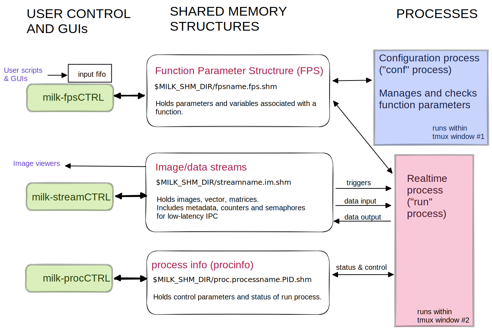

# Building Blocks (milk)

CACAO is a plugin for milk, which is built around 3 data structures, each held in shared memory for low-latency inter-process communication:

* **function parameter structure (FPS)** holding the parameters and variables for a function
* **data streams**, containing images and other numerical data, along with metadata and synchronization handles (semaphores and counters). Streams are provided by the ImageStreamIO library
* **processinfo** structures holding status and control variables for a real-time process

Each real-time process has its own processinfo and FPS structures, and may interact (read/write) with multiple data streams.

milk provides GUIs to inspect and interact with these structures `milk-fpsCTRL`, `milk-streamCTRL` and `milk-procCTRL`.&#x20;




To learn more about milk's framework, including its 3 data structures, run

```
milk-tutorial
```



[function-parameter-structures-fps](function-parameter-structures-fps/)



[image-streams.md](image-streams.md)



[process-info-procinfo.md](process-info-procinfo.md)

