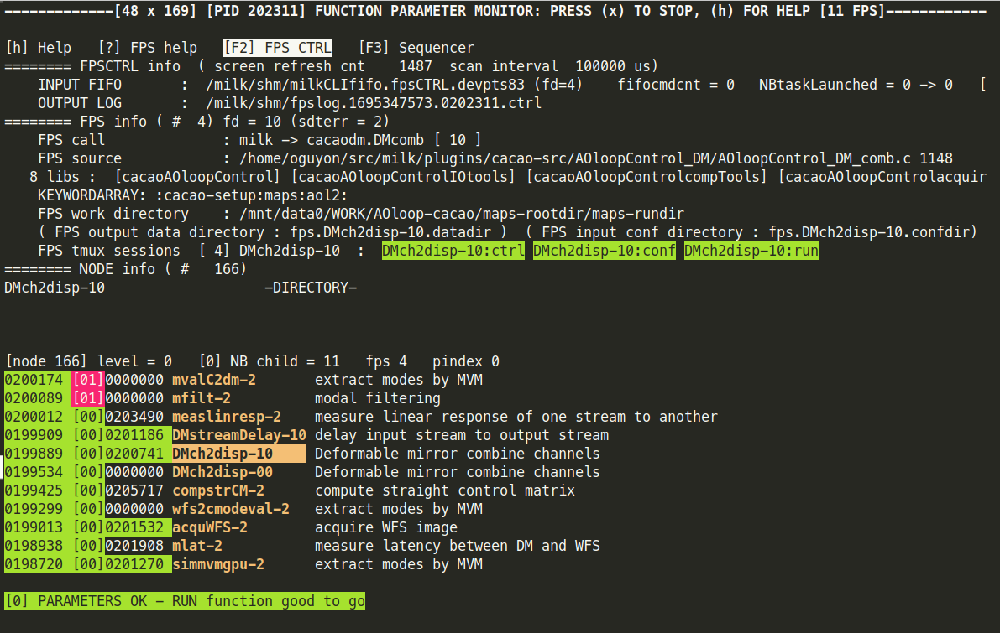
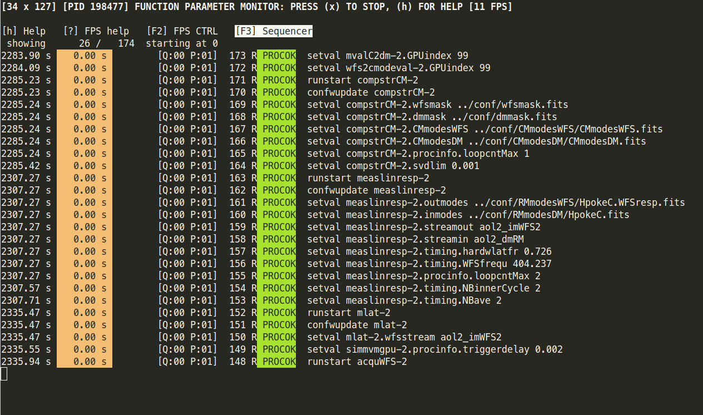

# Function Parameter Structures (FPS)

## Rationale

Each real-time process has its parameters (input and output) stored in a shared memory structure, the FPS, allowing low-latency communication with the process without impacting its performance. The FPS is shared with the realtime process, allowing for a non-realtime process to change function parameters (such as the AO loop gain) with no additional load on the realtime process.

## FPS control

Users can interact with FPSs with the fpsCTRL tool:

```
milk-fpsCTRL
```

(run with -h option for more information)


Users can interract with FPSs using the milk-fpsCTRL tool in two ways:

* GUI control navigation (type h within GUI for instructions)
* fpsCTRL's input fifo

## Using the fpsCTRL input fifo

By default, each instance of milk-fpsCTRL sets up an input fifo to which commands can be sent. The fifo name appears at the top of the terminal in the verbose mode (typing "V" in the GUI to toggle verbose mode).&#x20;

<figure><figcaption><p>milk-fpsCTRL main control screen, in verbose mode. The input fifo name is on the 5th line.</p></figcaption></figure>

As shown in the screenshot above, the default input fifo name follows the terminal name within which it is running, in order to avoid name collision. In this example, it is `/milk/shm/milkCLIfifo.fpsCTRL.devpts83`, where `devpts83` is the terminal name.

To set the input fifo name to a specfic name, use the -f option:

```bash
milk-fpsCTRL -f /tmp/mycustomfifo
```

Then, to issue commands to the fpsCTRL instance:

```bash
echo "my command" >> /tmp/mycustomfifo
```

The fpsCTRL tool will process commands one line at a time. The history of commands received and their processing status can be seen by typing F3 to enter the sequencer screen:

<figure><figcaption><p>milk-fpsCTRL sequencer screen, accessible by typing F3</p></figcaption></figure>

## cacao's fpsCTRL process

Each cacao loop has its own fpsCTRL process. It is hosted within a tmux session, with the name `loopname_fpsCTRL`. See example output of `tmux ls` command below for a loop named `maps`:

```
/mnt/data0/WORK/AOloop-cacao$ tmux ls
DMch2disp-00: 3 windows (created Thu Sep 21 15:52:34 2023)
DMch2disp-10: 3 windows (created Thu Sep 21 15:52:35 2023)
DMstreamDelay-10: 3 windows (created Thu Sep 21 15:52:35 2023)
acquWFS-2: 3 windows (created Thu Sep 21 15:52:33 2023)
compstrCM-2: 3 windows (created Thu Sep 21 15:52:34 2023)
maps_fpsCTRL: 1 windows (created Thu Sep 21 15:52:36 2023)
measlinresp-2: 3 windows (created Thu Sep 21 15:52:35 2023)
mfilt-2: 3 windows (created Thu Sep 21 15:52:36 2023)
mlat-2: 3 windows (created Thu Sep 21 15:52:33 2023)
mvalC2dm-2: 3 windows (created Thu Sep 21 15:52:36 2023)
simmvmgpu-2: 3 windows (created Thu Sep 21 15:52:33 2023)
wfs2cmodeval-2: 3 windows (created Thu Sep 21 15:52:34 2023)

```

The input fifo name for cacao's fpsCTRL process is `$MILK_SHM/loopname_fpsCTRL.fifo`. For the example above, it is `/milk/shm/maps_fpsCTRL.fifo`.

To send a command to the loop, scripts and users would issue commands such as:

```bash
echo "runstart mfilt-2.loopON ON" >> /milk/shm/maps_fpsCTRL.fifo
```


From a loop's root directory, the cacao-fpsctrl can send commands to the loop without specifying the loop number or input fifo. The above command can then be issued with:

`cacao-fpsctrl setval mfilt loopON ON`

This is quite handy to write generic scripts that are not tied to a specific loop index, and is used by most cacao high level scripts. The command reads the `LOOPNUMBER` and `LOOPNAME` local files to build the full command string and fifo name.



For more details about control through the input fifo, check:


[input-fifo-commands.md](input-fifo-commands.md)

