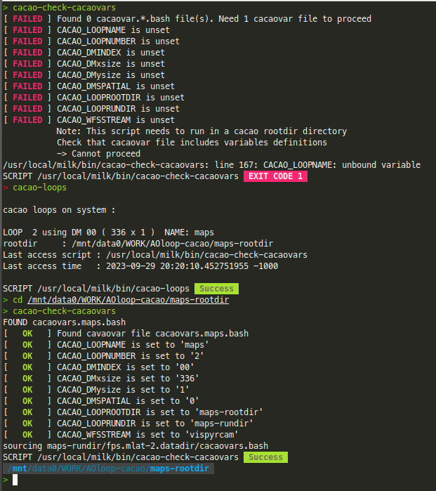

# Getting Situated

CACAO is a plugin of the milk package, which provides the [building blocks](building-blocks-milk/) for deploying realtime processes with low-latency interprocess communication, and also provides the user interfaces and controls to configure and operate the AO control loop.

## _CACAO_ Loops

_CACAO_ can run multiple AO loops, which may or may not interact. Each loop has a unique number, name, and root directory. To see which loop(s) are currently installed on a system, run:

<mark style="color:green;">`cacao-loops`</mark>

An example output is:

```
> cacao-loops

cacao loops on system :

LOOP  2 using DM 00 ( 336 x 1 )  NAME: maps
rootdir     : /mnt/data0/WORK/AOloop-cacao/maps-rootdir
Last access script : /usr/local/milk/bin/cacao-fpsctrl-logprocess
Last access time   : 2023-09-29 18:17:24.566123595 -1000

SCRIPT /usr/local/milk/bin/cacao-loops  Success 
```

## Running Commands

Most operations are done by running cacao scripts within the loop root directory (shown as rootdir in the example above). To get a list of all cacao scripts, run:

<mark style="color:green;">`cacao-commands`</mark>

Each command can be safely run with the `-h` option to print help.

Most cacao commands start by scanning the local directory for required files and environment variables, and will exit if requirements are not satisfied. To run this check alone, run:

<mark style="color:green;">`cacao-check-cacaovars`</mark>

The command will fail if not run in a loop's rootdir. Running the command is a good way to check what type of AO loop is configured.


<figure><figcaption><p>Running cacao-loops and cacao-check-cacaovars to learn about loop settings.</p></figcaption></figure>

## Deploying an AO loop

CACAO comes with a few example AO loops, used on actual AO systems and maintained by the corresponding AO groups. To deploy one of the examples, run <mark style="color:green;">`cacao-loop-deploy`</mark>. Run with the `-h` option for help and brief description of the examples


##
