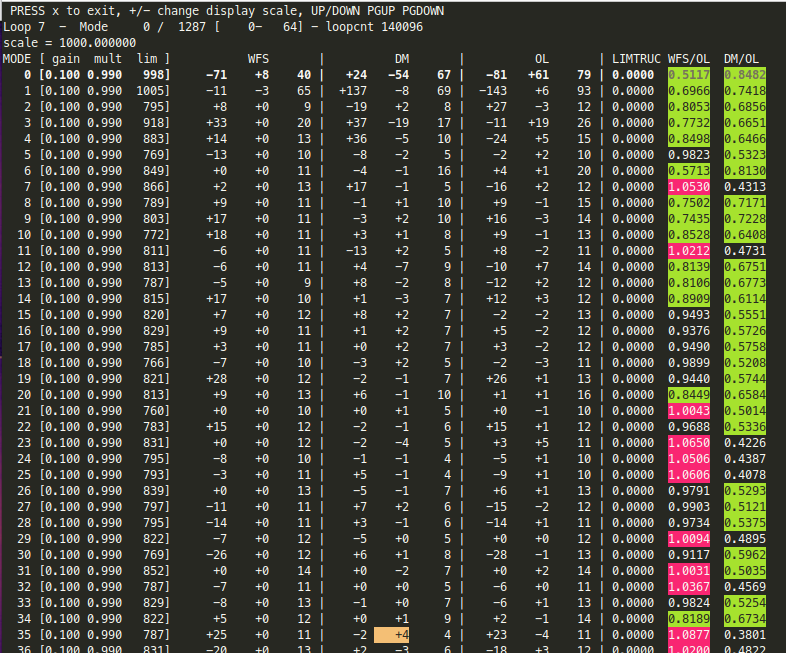

# Modal Stats TUI

```bash
# Modal stats
#
cacao-modalstatsTUI
```


<figure><figcaption><p>modal stats TUI screen</p></figcaption></figure>

Real-time modal coefficient stats are displayed by running `cacao-modalstatsTUI`.

One line per mode (mode index shown on the left). Use the up/down arrows and PgUp/PgDn to scroll. Use the + and - keys to change the scaling of values by 10x.

From left to right:

* Modal setting \[gain mult limit]
* WFS modal values:  current, average, RMS
* DM modal values: current, average, RMS
* Pseudo-open loop values: current, average, RMS
* LIMTRUNC: Fraction of DM commands truncated by the limit setting. Red if clipping.
* WFS/OL: Ratio between residual WFS RMS and pseudo-openloop RMS. This is the **fraction of the input disturbance that is corrected by the loop**, and should ideally be less than unity. The value is highlighted in green if <0.9, and red if >1.
* DM/OL: Ratio between DM RMS and pseudo-openloop RMS. Green if >0.5.

Loop tuning guidelines:

* Check out that the limit is not clipping correction. The modal limit should ideally be set low enough to clip outliers and prevent the loop from running out, but high enough so that truncation is infrequent.
* Check that WFS/OL is <0.9 (green), and optimize modal gains to drive this value as low as possible
* Check that DM/OL is close to one: the DM correction is tracking the OL value

Note that at low flux levels, WFS is overestimated by photon noise and readout noise, and WFS/OL can become closer to 1.0. This simple TUI does not compensate for photon and readout noise.


