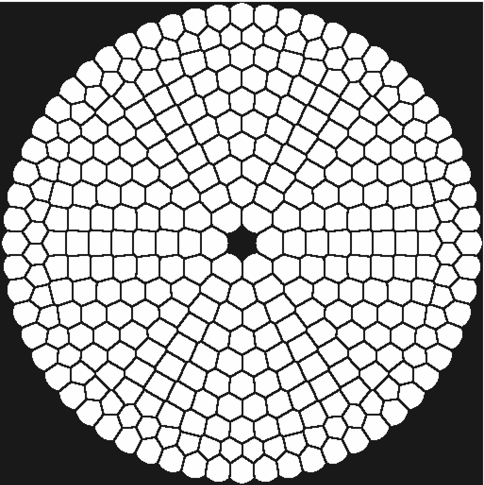
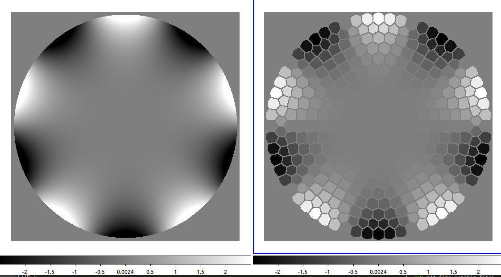

# Arbitrary DM & WFS geometries (non-square-grid)

DM and WFS geometries that are not on a regular square grid pattern are stored as 1D arrays in shared memory, instead of 2D.

The 1D representation can be mapped to a 2D array using a tessellation (also referred to as mapping) of the 2D plane, where each 1D pixel maps to a 2D zone in the the 2D representation.

## Building the 2D mapping file

The 2D mapping file is stored as a 2D image.

To create the mapping from a list of actuators, we use the Voronoi tessallation. The script below takes as input a text file (`act2Dpos.txt)` listing actuator coordinates and creates the tessellation map.


```bash
#!/usr/bin/env bash

MAPSIZE=50
ZONERADIUS="0.07"
ZONEGAP="0.003"

# Build a FITS format actuator list from the input ASCII list of actuators
# The FITS file, named actpos.fits, has size 2 x 336, for 2 dimensions and 336 actuators
#
echo "milk-all << EOF" > mk2DactposFITS
echo "mk2Dim actpos 2 336" >> mk2DactposFITS
awk '{printf("setpix actpos %.4f 0 %d\nsetpix actpos %.4f 1 %d\n", $2*0.95, $1, $3*0.95, $1)}' act2Dpos.txt >> mk2DactposFITS
echo "saveFITS actpos actpos.fits" >> mk2DactposFITS
echo "exitCLI" >> mk2DactposFITS
echo "EOF" >> mk2DactposFITS

chmod +x mk2DactposFITS
./mk2DactposFITS

# Build the Voronoi tessellation
#
milk-all << EOF
loadfits actpos.fits actpos
imgen.voronoi actpos actmap $MAPSIZE $MAPSIZE $ZONERADIUS $ZONEGAP
saveFITS actmap mapping.fits
listim
exitCLI
EOF

```


The `act2Dpos.txt` file lists actuator coordinates, one actuator per line (actuator number, x pos, y pos)



The resulting 2D mapping file, for MAPSIZE=512, is shown below.

<figure><figcaption><p>Example 2D mapping for the MAPS AO system. The pixel value (not shown here) encodes actuator index. Pixels with value = -1 (shown as black here) do not map to any actuator.</p></figcaption></figure>


## Remapping 1D stream to 2D stream for visualization

The `pixremap` milk function takes the input (1D) values and remap them into a 2D image using the mapping file created above.


```bash
#!/usr/bin/env bash

milk-all << EOF
readshmim stream1D
loadfits mapping.fits mapping
pixremap stream1D mapping stream2D
exitCLI
EOF

```


The remapping can be run in a real-time loop. In this example, we first create an array of random values updating at 100 Hz


```bash
#!/usr/bin/env bash

# create actuator values 1D array with random values
#
milk-all << EOF

# set as infinite loop running at 100 Hz
imgen.mkrnd ..procinfo 1
imgen.mkrnd ..triggermode 4
imgen.mkrnd ..triggerdelay 0.01
imgen.mkrnd ..loopcntMax -1

# make output shared memory stream
imgen.mkrnd .outim.shared 1

imgen.mkrnd act1Dval 336 1
listim
exitCLI
EOF

```


The remapping function remaps the `act1Dval` stream to `act2Dim`.


```bash
#!/usr/bin/env bash

# Remap to 2D, loop
#
milk << EOF
readshmim act1Dval
loadfits mapping.fits mapping
# make output shared memory stream
pixremap .outim.shared 1
pixremap ..procinfo 1

# trigger on semaphore of stream act1Dval
pixremap ..triggermode 3
pixremap ..triggersname act1Dval

# run forever, until killed
pixremap ..loopcntMax -1

pixremap act1Dval mapping act2Dim
exitCLI
EOF
```


The output `act2Dim` stream shows the 2D representation, updating at 100 Hz.



## Unmapping from 2D back to 1D

The `pixunmap` function unmaps a 2D array into a 1D array using pixel value averaging over each zone in the mapping file.


```bash
#!/usr/bin/env bash

# unmap from 2D to 1D using pixel value averaging over each zone
#
milk-all << EOF
zern.mkzer z20 512 20 250.0
saveFITS z20 "z20.fits"
loadfits mapping.fits mapping
pixunmap z20 mapping act1Dval
saveFITS act1Dval "act1Dim.fits"
exitCLI
EOF

# Map back to 2D for checking
milk << EOF
loadfits act1Dim.fits act1Dval
loadfits mapping.fits mapping
pixremap act1Dval mapping act2Dim
saveFITS act2Dim "act2Dim.fits"
exitCLI
EOF

```


The `z20.fits` and `act2Dim.fits` images are shown below for the example script.

<figure><figcaption></figcaption></figure>

The pixunmap function can be deployed as a real-time process as in the previous examples.

