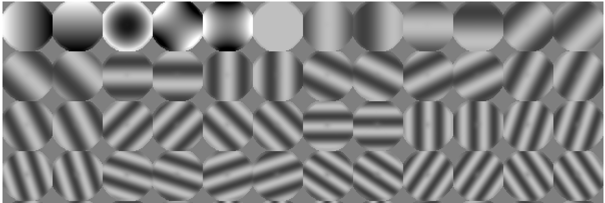
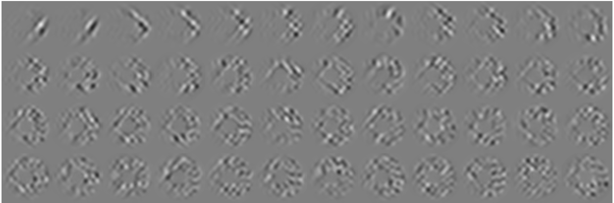
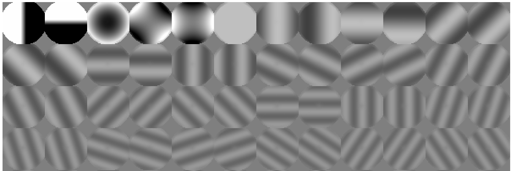
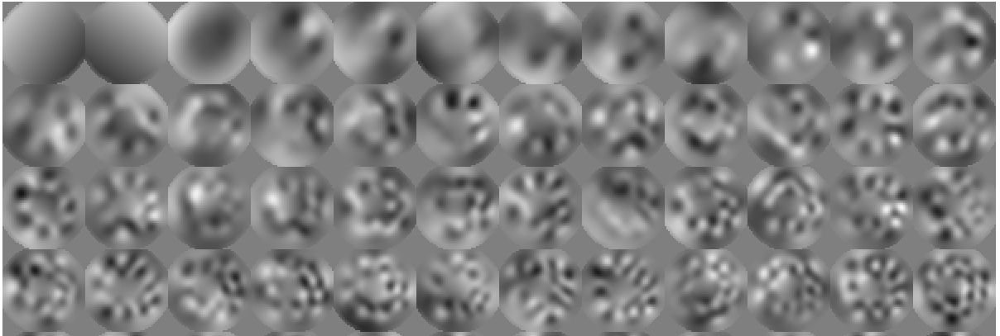
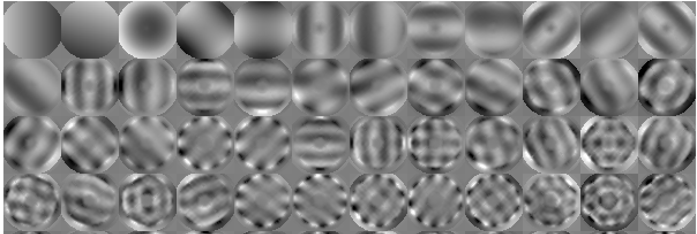
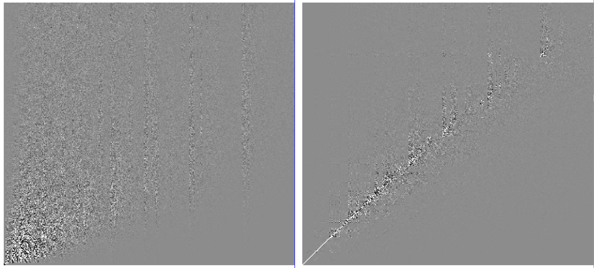

# Control Modes - Advanced

## Introduction

Cacao implements modal control, where the input signal (WFS image for example) is linearly decomposed as a sum of modes. The coefficients of this decomposition represent the input measurement in the control modal space. The coefficients are then processed to compute a modal control command.

At the hart of the modal control are the control modes, a set of modes with corresponding representations in input (WFS) and output (DM) spaces. _**What should these modes be ?**_

A few options are discussed in sections 1 and 2, with increasing complexity and performance, as summarized in the table below.

<table><thead><tr><th width="126">Approach</th><th width="272">Description</th><th width="56" data-type="checkbox">ns?</th><th width="64" data-type="checkbox">ma?</th><th width="59" data-type="checkbox">aa?</th><th width="61" data-type="checkbox">as?</th><th width="58" data-type="checkbox">ad?</th></tr></thead><tbody><tr><td><a href="control-modes-advanced.md#1.-svd-modes-straight-svd-of-response-matrix-pseudo-inverse">RMpsinv</a></td><td>straight SVD of RM (regularized pseudo-inverse)</td><td>true</td><td>false</td><td>false</td><td>false</td><td>false</td></tr><tr><td><a href="control-modes-advanced.md#2.1.-amplitude-weighting-of-zernike-+-fourier-response-matrix">wRMpsinv</a></td><td>weighted-RM pseudo-inverse</td><td>true</td><td>true</td><td>false</td><td>false</td><td>false</td></tr><tr><td><a href="control-modes-advanced.md#2.2.-atmospheric-turbulence-kl-modes">atmKL</a></td><td>KL of atmospheric wavefronts WFS response</td><td>true</td><td>true</td><td>true</td><td>false</td><td>false</td></tr><tr><td><a href="control-modes-advanced.md#2.4.-adaptive-close-loop-kl-control-mode">aCLKL</a></td><td>adaptive close-loop KL</td><td>true</td><td>true</td><td>true</td><td>true</td><td>true</td></tr></tbody></table>


* \[n**s**] Handles measurement null space
* \[**ma**] Allows for setting modal amplitudes
* \[**aa**] Takes into account atmospheric turbulence modal amplitudes
* \[**as**] Takes into account atmospheric turbulence temporal evolution (speed) of modes
* \[**ad**] Adapts to changing conditions and residual wavefront errors

***

## **1. SVD modes (straight SVD of response matrix = pseudo-inverse)**

_**SVD modes**_ are often used for AO control. They are the modes computed by singular value decomposition of the system response matrix. They allow for a regularized pseudo-inverse of the response matrix to be used for control. The SVD modes are ordered by singular value, with the first modes corresponding to the unity norm DM actuator producing the strongest WFS response. See [Computing Control Modes - Basics](../steps-by-step-instructions/computing-control-modes.md) for more details, notations, and how to computer SVD modes.

### 1.1. Why SVD modes ?

Using SVD modes for control allows for identification of the WFS null space, corresponding to DM actuations that cannot be measured by the WFS. In the presense of noise, the null space is a fuzzy concept, as some DM commands will produce a weak (but non-zero) WFS signal. Our control law needs to filter modes with weak or zero response, but we should to do so in a controlled way, balancing the need to control as many modes as possible, but avoid amplifying noise. The SVD modes allow for this tuning, where we can control the strongest modes (the ones mode readily sensed by the WFS) with high gain, and apply lower gain for modes that are weakly sensed. **In modal control with SVD modes, control gains are tuned for each mode, primarily as a function of how well a mode is sensed.**

### **1.2. SVD modes - Example**

The SVD modes are computed from the response matrix, which consists of pairs of DM poke modes and their corresponding WFS response. The two figures below show the RM poke modes and the corresponding WFS response. Only the first 48 modes are shown.

<figure><figcaption><p><strong>Response matrix DM modes</strong>. These are the DM patterns for which the corresponding WFS response is measured.</p></figcaption></figure>

The response matrix DM mode were here created by concatenating the first 5 Zernike modes, and Fourier modes of increasing spatial frequency.

<figure><figcaption><p><strong>WFS response to the response matrix DM modes.</strong></p></figcaption></figure>

Here, we used a pyramid WFS, so we see that each of the 48 modal responses (arranged here in a 12x4 grid) consists of 4 pupil images.&#x20;

Note that we computed these responses by multiplying the zonal response matrix (measured) by the response matrix DM modes. Thanks to linearity, this is equivalent to poking the actual DM modes, but it is more flexible. To compute the response matrix DM and WFS modes above:

```bash
# Compute RM modes in Zernike+Fourier basis
#
# -t 1.0 : do not amplify TT
# -a 0.0 : do not apply power-law to Fourier modes
# 
cacao-aorun-033-RM-mksynthetic -t 1.0 -a 0.0
```

Now we compute the control modes by SVD with the <mark style="color:green;">`cacao-aorun-039-compstrCM`</mark> command:

```bash
# Compute SVD modes
#
cacao-aorun-039-compstrCM
```

The DM control modes (file `conf/CMmodesDM/CMmodesDM.fits`) are shown below.

<figure><figcaption><p>Control modes, DM space.</p></figcaption></figure>

The first mode (top left) is the DM pattern that will generate the strongest WFS response.&#x20;

### 1.3. Limitations of straight SVD modes

A key limitation of SVD modes, apparent in the figure, is that _**they do not take into account the statistical properties of input disturbances**_. The dominant SVD modes (largest singular value) may be quite different from the modes with the strongest amplitude in atmospheric turbulence.

Also, we may want to force control modes to match some specific target. For example, the first two control modes may need to be as close as possible to Tip and Tilt so that pointing can easily be offloaded to another loop. We may want the control modes to be ordered by spatial frequency, as the statistical properties of atmospheric turbulence (amplitude, speed) are driven by spatial frequency.

***

## 2. Tuning the response matrix prior to SVD computation

We show here how we can still compute the control modes by SVD, but with a different input response matrix. This approach mitigates some of the issues of the straight SVD computation above.

With knowledge that some modes have stronger amplitude in the input, we can build an amplitude-aware response matrix (RM), where the RM is now a better representation of input disturbances.

### 2.1. Amplitude weighting of Zernike + Fourier response matrix

The first approach is to construct a sensible set of DM modes from Zerkine and Fourier modes, and set their amplitudes to capture the expected statistical properties of input disturbances. Here, we set the first 5 modes to be Zerkines (Tip, Tilt, Focus, Astigmatism), and subsequent modes to be Fourier modes of increasing spatial frequency. We multiply the tip-tilt amplitude by 8x as we expect some pointing vibrations, and we gradually decrease the amplitude of high spatial frequencies with a power-law.


This feature requires a zonal response matrix and a geometric representation of the DM, where DM actuator pixel coordinates correspond to actual geometrical position.


A synthetic set of modes, ordered by spatial frequency, is created in DM space.&#x20;

```bash
# Compute RM modes in Zernike+Fourier basis
#
# -t 8.0 : amplify TT by 8x
# -a 1.0 : apply power-law to Fourier modes
# use -c option for max spatial frequency [CPA]
# use -z option for number of Zernike modes
# 
cacao-aorun-033-RM-mksynthetic -t 8.0 -a 1.0
```

The corresponding RM DM modes exhibit the desired modal amplitude:

<figure><figcaption><p>Response matrix DM modes with aplification of TT and power-law amplitude decay of higher spatial frequencies</p></figcaption></figure>

The WFS response to these modes is computed from the zonal response matrix. The synthetic RM modes are weighted by spatial frequency prior to computing the CM. Doing so will ensure that the resulting CM is approximately ordered by spatial frequency.

The SVD modes computed by <mark style="color:green;">`cacao-aorun-039-compstrCM`</mark> will now prioritize modes based on both WFS sensitivity and input amplitude.&#x20;

<figure><figcaption><p>Control modes in DM space, from SVD of weighted Zernike+Fourier response matrix</p></figcaption></figure>

The new control modes are now approximately ordered by spatial frequency, with the first two modes tip and tilt, and the third mode close to focus. These control modes are much improved compared to the ones obtained by straight SVD of the response matrix.

### 2.2. Atmospheric turbulence KL modes

The response matrix modal weighting presented in the previous section is a very approximate way to capture the physics of atmospheric turbulence. A more rigorous approach is to simulate, for the AO system considered, the WFS response to a large sample of atmospheric wavefronts and use this as the RM input to the control modes computation.

### 2.3. Data-driven atmospheric turbulence KL modes

Instead of simulating incoming wavefronts, the AO system can record, in open loop, a series of WFS frames. This has the advantage of capturing statistical behaviors that may not be known in advance (dome seeing, telescope vibrations etc).


The WFS must be linear in open-loop for this approach. It may also be possible to acquire the data in closed loop, recording the pseudo-open loop telemetry.


### 2.4. Adaptive close-loop KL control mode

Control modes should ideally prioritize the dominant close-loop wavefront modes instead of the open-loop ones.

So far, we have not considered the temporal evolution (speed) of input wavefront aberrations. The dominant control modes should be the ones for which the combination of amplitude _**and**_ speed requires the most aggressive correction. A very slow evolving mode does not require high loop gain, while a fast-moving aberration does. Computing CMs from close-loop telemetry does take speed into account.

The adaptive close-loop KL (aCLKL) approach implements the following steps:

* Collect residual WFS frames while the loop is running
* Perform PCA of WFS frames
* Replace response matrix by PCA components above, in corresponding DM-WFS pairs
* Recompute control matrix (script <mark style="color:green;">`cacao-aorun-039-compstrCM)`</mark>
* Reload control matrix

The process requires some care. First, the collection phase needs to be sufficiently long to average noise and capture the statistical properties of the system. Second, reloading the CM will disrupt the loop.

***

## 3. Forcing control modes to match a target set of modes

It is often desirable to enforce specific modes to be control modes, either because the control loop interacts with other systems (for example an alignment loop requiring tip-tilt and focus as input values), or for performance optimization (adopting Fourier modes in an extreme-AO system to optimize the system as a function of angular separation).

The script <mark style="color:green;">`cacao-aorun-040-compfCM`</mark> allows for such optimization. Users can provide the target modes to which the control modes should be matched as an input with the -tm option, or let the script build a default set of DM modes (Zernikes + Fourier). The script places temporary files in the directory `./compfCM/`.

```bash
# Compute CM modes matching a target set of modes
#
# use -tm option to specify target modes
# use -g option to specify GPU device
# use -t option to write test files in ./compfCM/
# 
# Output :
# conf/CMmodesDM/CMmodesDM_sf.fits
# conf/CMmodesWFS/CMmodesWFS_sf.fits
#
cacao-aorun-040-compfCM -g 0 -c 10 -sm 0.01 -se 0.01 -m 12 -ef 1.1 -eo 0.3 -t
```

The script first computes a control modal space by SVD, and then applies rotations to try, as best as possible, to match the target modes. Rotations preserve orthonormality of the control modes in WFS space.

The main steps are:

* Compute target modes (Zernike+Fourier modes) if they are not provided by user
* Compute control modes by [SVD of weighted response matrix](control-modes-advanced.md#2.1.-amplitude-weighting-of-zernike-+-fourier-response-matrix)
* Perform Gramm-Schmidt on target modes to construct orthogonal target basis
* Compute decomposition of control modes in orthogonal target basis. The goal of the optimization is to rotate the control modes to make this decomposition as diagonal as possible
* Perform rotations to drive the decomposition to a diagonal. Note that the input target modes may have some redundancy (null space), while the control modes do not. Consequently, the diagonal may be curved or slanted (skipping extra modes in null space), so this optimization iteratively tracks the "diagonal"
* Apply rotations to control modes in both WFS and DM space

Unless the target modes are constructed from the control modes, it is gererally not possible to reach a perfect match while enforcing WFS-space orthonormality. The optimization algorithm is iterative and drives the control modes to approach the target modes.

The figure below shows the resulting control modes in DM space. Note that the first two modes are not perfectly orthogonal in DM space (the tip-tilt angles are not exactly 90 deg off), as orthonormality is enforced in WFS space, not in DM space.

<figure><figcaption><p>Control modes (DM) forced to match automatic taget modes (Zernke + Fourier)</p></figcaption></figure>

To visualize how well the new control modes match the target modes, the files `./compfCM/matABr.fits` shows how each control mode decomposes against the Gramm-Shmidt-processed target modes. The figure below shows this decomposition before (left) and after (right) the rotations are applied.

<figure><figcaption><p>Control mode decomposition against GS-processed target modes before (left) and after (right) optimization.</p></figcaption></figure>


***

## 4. Useful Tools and Scripts

### 4.1. Splitting cubes

Use [FITSIO extended file syntax](https://heasarc.gsfc.nasa.gov/docs/software/fitsio/filters.html) to split subset of modes from a larger set.

<details>

<summary>Extracting a subset of modes</summary>

```bash
#!/usr/bin/env bash

# extract first 10 modes from modes.fits
# save result in modes10.fits

milk << EOF
loadfits "modes.fits[*, *, 1:10]" modes10
saveFITS modes10 "modes10.fits"
exitCLI
EOF
```

</details>

### 4.2. Merging modes (concatenation)

Use <mark style="color:green;">`milk-images-merge`</mark> to merge (concatenate) modes.

```bash
# Create list of FITS files to merge
echo "modesA.fits" > mergelist.txt
echo "modesB.fits" >> mergelist.txt
echo "modesC.fits" >> mergelist.txt

# merge files along axis 2 (z axis)
milk-images-merge mergelist.txt 2 modesABC.fits
```

The corresponding milk script allows for more fine tuning (for example multiplying one of the input files by a scaling coefficients).

<details>

<summary>Concatenating modes</summary>

```bash
#!/usr/bin/env bash

milk << EOF
loadfits "modesA.fits" imA
loadfits "modesB.fits" imB
immerge imA imB imAB 0
saveFITS imAB "modesAB.fits"
exitCLI
EOF
```

</details>

### 4.3. Marginalizing one mode set against another one

Use <mark style="color:green;">`milk-modes-project`</mark> to ensure orthogonality between sets of modes.


```bash
# Make modesA orthogonal to modesTTF.fits
# modesTTF.fits are tip, tilt and focus modes
# modesA_noTTF.fits (residual) has tip, tilt and focus removed
#
milk-modes-project modesA.fits modesTTF.fits 0.001 modesA_TTFpart.fits modesA_noTTF.fit
```


<details>

<summary>Projection and marginalization between mode bases</summary>

```bash
#!/usr/bin/env bash

# Decompose modesA against modesB

modesA="$1"
modesB="$2"
SVDlim="0.001"

# project modesA onto space defined by modesB
# projection, residual

# Main steps:
# construct orthonormal basis from modesB using PCA
# decompose modesA using the PCA modes
# reconstruct projection using coefficients and PCA modes
# compute residual by subtraction reconstruction from original
# 
# OUTPUT:
# imrec.fits : reconstruction (projection)
# imres.fits : residual
#
milk-all << EOF
loadfits "$2" modesB
linalg.compSVD modesB svdU svdS svdV ${SVDlim}

loadfits "$1" modesA
linalg.sgemm .transpA 1
linalg.sgemm modesA svdU mcoeff

linalg.sgemm .transpA 0
linalg.sgemm .transpB 1
linalg.sgemm svdU mcoeff imrec
saveFITS imrec "imrec.fits"

imres=modesA-imrec
saveFITS imres "imres.fits"

exitCLI
EOF
```

</details>

### 4.4. Computing Control modes

<details>

<summary>Computing Control Modes</summary>

```bash
#!/usr/bin/env bash

# input
RMmDM="conf/EMmodesDM/RMmodesDM_custom.fits"
RMmWFS="conf/RMmodesWFS/RMmodesWFS_custom.fits"
DMm="conf/dmmask_custom.fits"
WFSm="conf/wfsmask_custom.fits"
SVDlim="0.01"

# output
CMmDM="conf/CMmodesDM/CMmodesDM_custom.fits"
CMmWFS="conf/CMmodesDM/CMmodesWFS_custom.fits"

cacao << EOF
cacaocc.compsCM $RMmDM $RMmWFS $DMm $WFSm $CMmDM $CMmWFS $SVDlim
exitCLI
EOF

```

</details>

### 4.5. Custom Assembly of CM

Using [tools and scripts](control-modes-advanced.md#1.-useful-tools-and-scripts) for custom assembly of CM.

###

