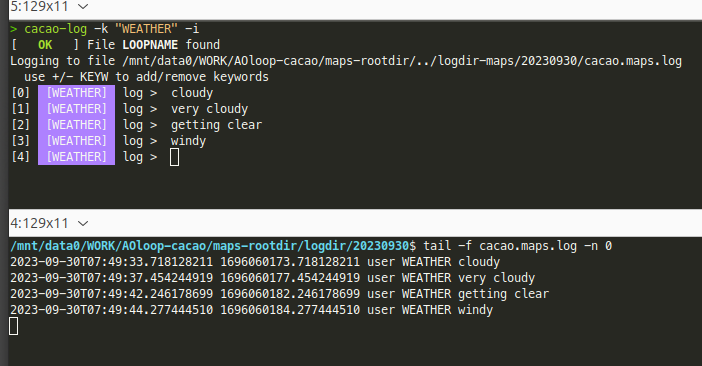

# Message logging

## 1. Conventions and Notations (reminder)

Environment variables are capital, and follow the syntax `$CACAO_ENVVARNAME`.  Commands are colored in green, and follow the syntax <mark style="color:green;">`milk_cmdname`</mark> or <mark style="color:green;">`cacao_cmdname`</mark> for milk and cacao commands respectively.

| Environment variable | Description                                                                        | Notes                                            |
| -------------------- | ---------------------------------------------------------------------------------- | ------------------------------------------------ |
| `$CACAO_LOOPROOTDIR` | Loop main directory, from which all commands should be run unless otherwise noted. | Run all commands from this directory             |
| `$CACAO_LOOPRUNDIR`  | Subdirectory of the root directory where processes are running.                    |                                                  |
| `$CACAO_LOOPNUMBER`  | Loop number index (integer)                                                        | Written if file LOOPNUMBER within root directory |
| `$CACAO_LOOPNAME`    | Loop name (string)                                                                 | Written in file LOOPNAME within root directory   |

##

***

## 2. Low-level (verbose) message Logs from fpsCTRL

cacao's fpsCTRL writes a log in`$CACAO_LOOPROOTDIR/fpsCTRL.log`


For commands to be logged into the log file, you need to run <mark style="color:green;">`milk-fpsCTRL`</mark> with the MILK\_FPS\_LOGFILE environment variable set to the logfile, or (better), run <mark style="color:green;">`cacao-fpsctrl-TUI`</mark> from directory CACAO\_LOOPROOTDIR

```bash
MILK_FPS_LOGFILE="fpsCTRL.log" milk-fpsCTRL
```

or (recommended):

```bash
cacao-fpsctrl-TUI
```



Running <mark style="color:green;">`milk-fpsCTRL`</mark> without setting `MILK_FPS_LOGFILE` will allow for control, but **will not** log commands.


Example low-level log content:

<details>

<summary>fpsCTRL.log</summary>

2023-09-19T01:08:42.555560692 1695085722.555560692 DEBUG CMDOK "setval acquWFS-2.procinfo.loopcntMax -1"&#x20;

2023-09-19T01:08:42.557115440 1695085722.557115440 DEBUG CMDRCV \[setval acquWFS-2.WFSnormfloor 1.0]&#x20;

2023-09-19T01:08:42.557133243 1695085722.557133243 DEBUG FPS ENTRY FOUND : acquWFS-2.WFSnormfloor 8 26&#x20;

2023-09-19T01:08:42.557139540 1695085722.557139540 SETVAL acquWFS-2.WFSnormfloor FLOAT32 1.000000&#x20;

2023-09-19T01:08:42.558075743 1695085722.558075743 DEBUG CMDOK "setval acquWFS-2.WFSnormfloor 1.0"&#x20;

2023-09-19T01:08:43.142855007 1695085723.142855007 DEBUG CMDRCV \[setval DMch2disp-10.option.voltmode OFF]&#x20;

2023-09-19T01:08:43.142872689 1695085723.142872689 DEBUG FPS ENTRY FOUND : DMch2disp-10.option.voltmode 4 29&#x20;

2023-09-19T01:08:43.142880289 1695085723.142880289 SETVAL DMch2disp-10.option.voltmode ONOFF OFF&#x20;


</details>


When using cacao's automatic deployment framework, `$CACAO_LOOPROOTDIR/fpsCTRL.log` should be a sym link to `$MILK_SHM_DIR/fpsCTRL-$CACAO_LOOPNAME.log`, which, being within a tmpdir, **will not** persist through computer reboots.



## 3. Daily Message Logs

fpsCTRL.log is quite verbose and includes multiple DEBUG statements. It is also non-persistent (lost upon reboot). The <mark style="color:green;">cacao-msglogCTRL</mark> command should be run to process this low-level log into a more useful daily log. This is started with:

```bash
# Process low-level log to write daily log
# 
# Runs in tmux window fpsCTRLlog-proc-LOOPNAME
# Output is echoed in tmux session fpsCTRL-out-LOOPNAME
#
cacao-msglogCTRL start
```

The command will process the low-level log and create 2 daily logs:



DIRECTORY: `$CACAO_LOOPROOTDIR/../logdir-$CACAO_LOOPNAME/YYYYMMDD/`

FILE: `fpsctrl.$CACAO_LOOPNAME.log`

Processed from low-level fpsCTRL log, removing DEBUG statements.

Adds regular polling: every minute, the current status of all fps entries is included, under the STATUS category.&#x20;

Example content:

```
2023-09-30T06:51:59.588105445 1696056719.588105445  STATUS       simmvmgpu-2.option.axmode UINT32 1
2023-09-30T06:51:59.588108350 1696056719.588108350  STATUS       simmvmgpu-2.option.PROCESS ONOFF OFF
2023-09-30T06:51:59.588111311 1696056719.588111311  STATUS       simmvmgpu-2.option.TRACEMODE ONOFF OFF
2023-09-30T06:51:59.588114143 1696056719.588114143  STATUS       simmvmgpu-2.option.MODENORM ONOFF OFF
2023-09-30T06:51:59.588117450 1696056719.588117450  STATUS       simmvmgpu-2.option.sname_intot STREAMNAME NULL
2023-09-30T06:51:59.588120529 1696056719.588120529  STATUS       simmvmgpu-2.option.sname_refin STREAMNAME NULL
2023-09-30T06:51:59.588123660 1696056719.588123660  STATUS       simmvmgpu-2.option.sname_refout STREAMNAME aol2_simLHSwfsref
2023-09-30T06:51:59.588126960 1696056719.588126960  STATUS       simmvmgpu-2.option.twait UINT64 0
2023-09-30T06:51:59.588130239 1696056719.588130239  STATUS       simmvmgpu-2.option.mmax UINT32 100000
2023-09-30T06:51:59.588138355 1696056719.588138355  STATUS       simmvmgpu-2.option.nmax UINT32 100000
2023-09-30T06:53:31.290406303 1696056811.290406303  SETVAL       mfilt-2.loopZERO ONOFF ON
2023-09-30T06:53:32.917511769 1696056812.917511769  SETVAL       mfilt-2.loopON ONOFF OFF
2023-09-30T06:53:33.858064631 1696056813.858064631  SETVAL       mfilt-2.loopON ONOFF ON
2023-09-30T06:53:37.532668615 1696056817.532668615  SETVAL       mfilt-2.loopgain FLOAT32 0.2

```



DIRECTORY: `$CACAO_LOOPROOTDIR/../logdir-$CACAO_LOOPNAME/YYYYMMDD/`

FILE: `cacao.$CACAO_LOOPNAME.log`

Example content:

```
2023-09-30T03:39:30.095558084 1696045170.095558084 cacao-aorun-039-compstrCM cp conf/CMmodesWFS.fits logdir/aol_maps/CMmodesWFS//CMmodesWFS.2023-09-30T03:39:30.074774513Z.fits
2023-09-30T03:39:30.107010701 1696045170.107010701 cacao-aorun-039-compstrCM END
2023-09-30T03:39:30.666192190 1696045170.666192190 cacao-aorun-050-wfs2cmval START
2023-09-30T03:39:30.667943119 1696045170.667943119 cacao-aorun-050-wfs2cmval END
2023-09-30T03:39:30.759390557 1696045170.759390557 cacao-aorun-060-mfilt START
2023-09-30T03:39:30.761053656 1696045170.761053656 cacao-aorun-060-mfilt END
2023-09-30T03:39:30.868302925 1696045170.868302925 cacao-aorun-070-cmval2dm START
2023-09-30T03:39:30.873824011 1696045170.873824011 cacao-aorun-070-cmval2dm END
2023-09-30T06:39:47.065154932 1696055987.065154932 cacao-msglogCTRL START
2023-09-30T06:39:49.137695438 1696055989.137695438 cacao-msglogCTRL END

```



To stop the daily log (run at end of night):

```bash
cacao-msglogCTRL stop
```


<mark style="color:green;">cacao-msglogCTRL</mark> will process all low-level log entries since the beginning of the day (UT), and write them in the daily fpsCTRL log. The cacao daily log will however only include commands entered while <mark style="color:green;">cacao-msglogCTRL</mark> is running.



## 4. Viewing the daily fpsCTRL message log in real time

Processing of the low-level fpsCTRL log to the daily log is running within a tmux session. To view the output in real time, with colors:

```bash
tmux a -t fpsCTRLlog-$CACAO_LOOPNAME-vispyr2
```

<figure><figcaption><p>Content of fpsCTRL processing tmux session</p></figcaption></figure>

## 5. Adding custom log entries to the daily cacao log

The <mark style="color:green;">cacao-log</mark> command adds custom log entries. To add a single entry in the daily cacao log:

```bash
cacao-log "custom log entry"
```

To start an interactive (persistent) logging terminal with a keyword (=category):

```bash
cacao-log -k "WEATHER" -i
```

<figure><figcaption><p>Example use of custom log entries, interactive mode</p></figcaption></figure>

